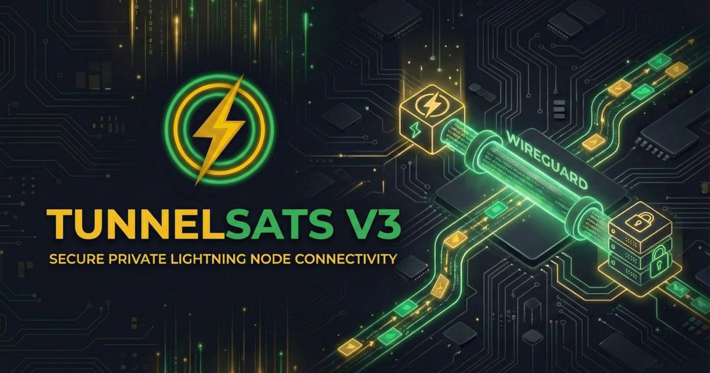
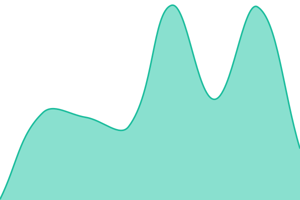
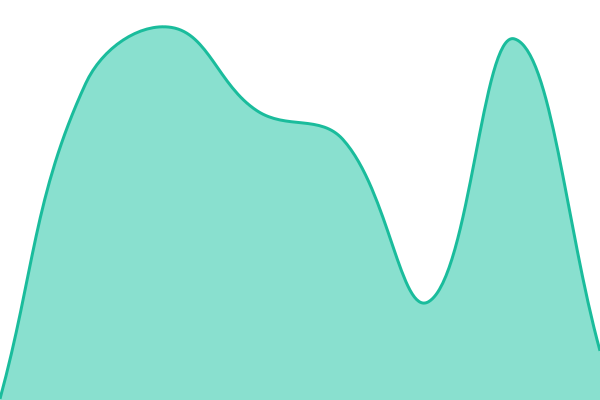

# [📈 Live Status](https://upptime.github.io/upptime): <!--live status--> **🟩 All systems operational**

This repository contains the open-source uptime monitor and status page for [Tunnel⚡️Sats](https://tunnelsats.com/), powered by [Upptime](https://github.com/upptime/upptime).

The below server connections are done by US-located github servers, and give you a reliable indicator of the online-status, while the connection times mayb be skewed. This is, because from the US github-servers, our US-VPNs are much closer and better peering connected. So word of advice, take the response times with a grain of salt.

<!--start: status pages-->
<!-- This summary is generated by Upptime (https://github.com/upptime/upptime) -->
<!-- Do not edit this manually, your changes will be overwritten -->
<!-- prettier-ignore -->
| URL | Status | History | Response Time | Uptime |
| --- | ------ | ------- | ------------- | ------ |
|  [🇺🇸 us1.tunnelsats.com](https://us1.tunnelsats.com) | 🟩 Up | [us1-tunnelsats-com.yml](https://github.com/Tunnelsats/upptime/commits/HEAD/history/us1-tunnelsats-com.yml) | 

 211ms
     
 | 

<a href="https://status.tunnelsats.com/history/us1-tunnelsats-com">100.00%</a>
    

|  [🇺🇸 us2.tunnelsats.com](https://us2.tunnelsats.com) | 🟩 Up | [us2-tunnelsats-com.yml](https://github.com/Tunnelsats/upptime/commits/HEAD/history/us2-tunnelsats-com.yml) | 

 291ms
     
 | 

<a href="https://status.tunnelsats.com/history/us2-tunnelsats-com">100.00%</a>
    

|  [🇺🇸 us3.tunnelsats.com](https://us3.tunnelsats.com) | 🟩 Up | [us3-tunnelsats-com.yml](https://github.com/Tunnelsats/upptime/commits/HEAD/history/us3-tunnelsats-com.yml) | 

 126ms
     
 | 

<a href="https://status.tunnelsats.com/history/us3-tunnelsats-com">100.00%</a>
    

|  [🇸🇬 sg1.tunnelsats.com](https://sg1.tunnelsats.com) | 🟩 Up | [sg1-tunnelsats-com.yml](https://github.com/Tunnelsats/upptime/commits/HEAD/history/sg1-tunnelsats-com.yml) | 

 748ms
     
 | 

<a href="https://status.tunnelsats.com/history/sg1-tunnelsats-com">100.00%</a>
    

|  [🇧🇷 br1.tunnelsats.com](https://br1.tunnelsats.com) | 🟩 Up | [br1-tunnelsats-com.yml](https://github.com/Tunnelsats/upptime/commits/HEAD/history/br1-tunnelsats-com.yml) | 

 501ms
     
 | 

<a href="https://status.tunnelsats.com/history/br1-tunnelsats-com">100.00%</a>
    

|  [🇩🇪 de1.tunnelsats.com](https://de1.tunnelsats.com) | 🟩 Up | [de1-tunnelsats-com.yml](https://github.com/Tunnelsats/upptime/commits/HEAD/history/de1-tunnelsats-com.yml) | 

 384ms
     
 | 

<a href="https://status.tunnelsats.com/history/de1-tunnelsats-com">100.00%</a>
    

|  [🇩🇪 de2.tunnelsats.com](https://de2.tunnelsats.com) | 🟩 Up | [de2-tunnelsats-com.yml](https://github.com/Tunnelsats/upptime/commits/HEAD/history/de2-tunnelsats-com.yml) | 

 386ms
     
 | 

<a href="https://status.tunnelsats.com/history/de2-tunnelsats-com">100.00%</a>
    

|  [🇩🇪 de3.tunnelsats.com](https://de3.tunnelsats.com) | 🟩 Up | [de3-tunnelsats-com.yml](https://github.com/Tunnelsats/upptime/commits/HEAD/history/de3-tunnelsats-com.yml) | 

 397ms
     
 | 

<a href="https://status.tunnelsats.com/history/de3-tunnelsats-com">100.00%</a>
    

|  [🇦🇺 au1.tunnelsats.com](https://au1.tunnelsats.com) | 🟩 Up | [au1-tunnelsats-com.yml](https://github.com/Tunnelsats/upptime/commits/HEAD/history/au1-tunnelsats-com.yml) | 

 627ms
     
 | 

<a href="https://status.tunnelsats.com/history/au1-tunnelsats-com">100.00%</a>
    

|  [🇨🇭 ch1.tunnelsats.com](https://ch1.tunnelsats.com) | 🟩 Up | [ch1-tunnelsats-com.yml](https://github.com/Tunnelsats/upptime/commits/HEAD/history/ch1-tunnelsats-com.yml) | 

 382ms
     
 | 

<a href="https://status.tunnelsats.com/history/ch1-tunnelsats-com">100.00%</a>
    

|  [Tunnel⚡️Sats Frontend](https://tunnelsats.com) | 🟩 Up | [tunnel-sats-frontend.yml](https://github.com/Tunnelsats/upptime/commits/HEAD/history/tunnel-sats-frontend.yml) | 

 450ms
     
 | 

<a href="https://status.tunnelsats.com/history/tunnel-sats-frontend">100.00%</a>
    

<!--end: status pages-->

[**Visit our status website →**](https://status.tunnelsats.com)

## 📄 License

- Powered by: [Upptime](https://github.com/upptime/upptime)
- Code: [MIT](./LICENSE) © [Upptime](https://upptime.js.org)
- Data in the `./history` directory: [Open Database License](https://opendatacommons.org/licenses/odbl/1-0/)
